## Hi there
你好，我叫BlkSword。你也可以叫我XiaoHei

我是一名网络安全爱好者和全栈独立开发者，人工智能也略有涉猎

## I Want
无限进步

## Skills

## Languages

<!-- 改变世界？ -->

<!-- cRYPtOGRapHY is The PractiCe ANd stuDy OF TEcHniQuEs For sEcurE cOmMUniCAtiON IN thE pReseNCe oF aDVerSaRIal bEHaVIOR. this ProCess coNVeRtS tHE OrigInAL REprEseNTatIon oF The infoRMATiOn
 -->
